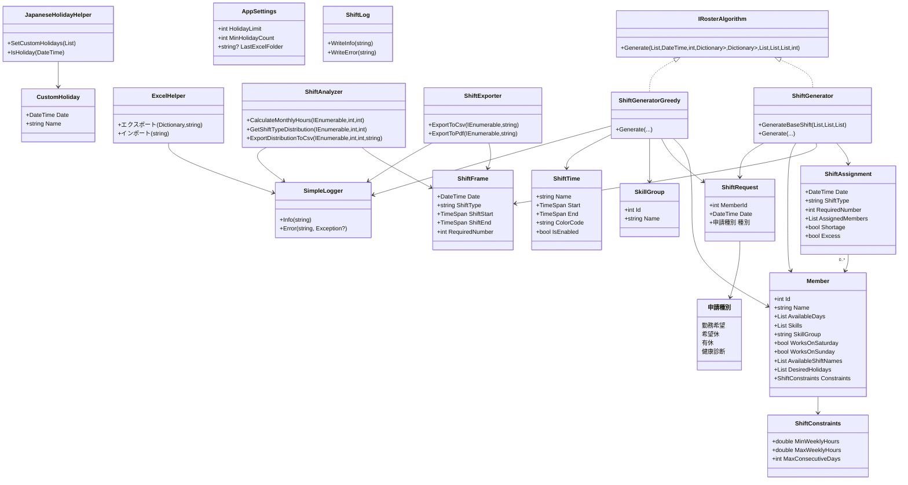

# ShiftPlanner クラス図

```mermaid
classDiagram
    class Member {
        +int Id
        +string Name
        +List<DayOfWeek> AvailableDays
        +List<string> Skills
        +string SkillGroup
        +bool WorksOnSaturday
        +bool WorksOnSunday
        +List<string> AvailableShiftNames
        +List<DateTime> DesiredHolidays
        +ShiftConstraints Constraints
    }
    class ShiftConstraints {
        +double MinWeeklyHours
        +double MaxWeeklyHours
        +int MaxConsecutiveDays
    }
    Member --> ShiftConstraints

    class ShiftRequest {
        +int MemberId
        +DateTime Date
        +申請種別 種別
    }
    class 申請種別 {
        勤務希望
        希望休
        有休
        健康診断
    }
    ShiftRequest --> 申請種別

    class ShiftTime {
        +string Name
        +TimeSpan Start
        +TimeSpan End
        +string ColorCode
        +bool IsEnabled
    }

    class SkillGroup {
        +int Id
        +string Name
    }

    class ShiftFrame {
        +DateTime Date
        +string ShiftType
        +TimeSpan ShiftStart
        +TimeSpan ShiftEnd
        +int RequiredNumber
    }

    class ShiftAssignment {
        +DateTime Date
        +string ShiftType
        +int RequiredNumber
        +List<Member> AssignedMembers
        +bool Shortage
        +bool Excess
    }
    ShiftAssignment "0..*" --> Member

    class CustomHoliday {
        +DateTime Date
        +string Name
    }

    class JapaneseHolidayHelper {
        +SetCustomHolidays(List<CustomHoliday>)
        +IsHoliday(DateTime)
    }
    JapaneseHolidayHelper --> CustomHoliday

    class AppSettings {
        +int HolidayLimit
        +int MinHolidayCount
        +string? LastExcelFolder
    }

    class ShiftLog {
        +WriteInfo(string)
        +WriteError(string)
    }
    class SimpleLogger {
        +Info(string)
        +Error(string, Exception?)
    }

    class ExcelHelper {
        +エクスポート(Dictionary<string,IList>,string)
        +インポート(string)
    }
    ExcelHelper --> SimpleLogger

    class ShiftAnalyzer {
        +CalculateMonthlyHours(IEnumerable<ShiftFrame>,int,int)
        +GetShiftTypeDistribution(IEnumerable<ShiftFrame>,int,int)
        +ExportDistributionToCsv(IEnumerable<ShiftFrame>,int,int,string)
    }
    ShiftAnalyzer --> ShiftFrame
    ShiftAnalyzer --> SimpleLogger

    class ShiftExporter {
        +ExportToCsv(IEnumerable<ShiftFrame>,string)
        +ExportToPdf(IEnumerable<ShiftFrame>,string)
    }
    ShiftExporter --> ShiftFrame
    ShiftExporter --> SimpleLogger

    class IRosterAlgorithm {
        +Generate(List<Member>,DateTime,int,Dictionary<DateTime,Dictionary<string,int>>,Dictionary<DateTime,Dictionary<string,int>>,List<ShiftRequest>,List<SkillGroup>,List<ShiftTime>,int)
    }

    class ShiftGenerator {
        +GenerateBaseShift(List<ShiftFrame>,List<Member>,List<ShiftRequest>)
        +Generate(...)
    }
    class ShiftGeneratorGreedy {
        +Generate(...)
    }
    IRosterAlgorithm <|.. ShiftGenerator
    IRosterAlgorithm <|.. ShiftGeneratorGreedy
    ShiftGenerator --> ShiftAssignment
    ShiftGenerator --> ShiftFrame
    ShiftGenerator --> Member
    ShiftGenerator --> ShiftRequest
    ShiftGeneratorGreedy --> Member
    ShiftGeneratorGreedy --> ShiftRequest
    ShiftGeneratorGreedy --> SkillGroup
    ShiftGeneratorGreedy --> ShiftTime
    ShiftGeneratorGreedy --> SimpleLogger
```

この図は ShiftPlanner プロジェクトの主要クラスとその関係を表しています。
